Margins and Multi-plotting
================

-   [Margins](#margins)
    -   [Basic margins](#basic-margins)
    -   [Plot devices](#plot-devices)
    -   [A final note on par() settings](#a-final-note-on-par-settings)
-   [Axes (Ax-ees, not axes) and a little more par()](#axes-ax-ees-not-axes-and-a-little-more-par)
    -   [Ax-ees](#ax-ees)
    -   [The edges of axes](#the-edges-of-axes)
-   [Plot limits](#plot-limits)
    -   [How plot() clips your data to the plot window](#how-plot-clips-your-data-to-the-plot-window)
    -   [The issue](#the-issue)
    -   [The opportunity](#the-opportunity)
-   [Multi-plotting](#multi-plotting)
    -   [mfrow & mfcol, The Hercules (Heracles?) of multi-plotting](#mfrow-mfcol-the-hercules-heracles-of-multi-plotting)
    -   [layout(), the Dionysis of multi-plotting](#layout-the-dionysis-of-multi-plotting)
    -   [Split.screen, the Zeus of multi-plotting.](#split.screen-the-zeus-of-multi-plotting.)

This document is a self-paced tutorial through some of the plotting tools provided in a base R installation. First, we'll cover how to handle margins, setting and controlling axes and other graphical parameters. Then we'll move onto including maps in base R plots, and finally we'll use a range of functions (from simple to complex) to design multi-plot figures.

There are some amazing resources online to help with these sorts of things. Here's two I found particularly useful:

1.  <http://research.stowers-institute.org/mcm/efg/R/Graphics/Basics/mar-oma/index.htm>. An excellent look at margin settings.

2.  <http://seananderson.ca/courses/11-multipanel/multipanel.pdf>. A very in-depth guide on the multi-plotting tools I run through here.

Margins
=======

Basic margins
-------------

Let's start with a look at how R classifies the three different spaces within a plot. Oh yes, there are three. The inner two and outer two share a boundary, and those are 'margins' that we can modify.

``` r
plot.new() # call an empty plot
box("plot", col="red") # add boxes around the plot area
box("figure", col="blue") # add box around figure area
box("outer", col="green") # add box around outer area
```

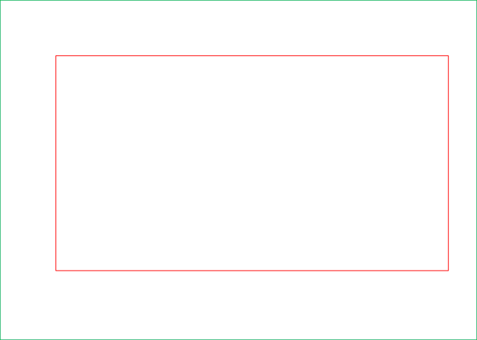

The space within the red box is called the "plot space". This is where all your data go, and your axes are plotted along the red lines. The space between the red box and the blue box (and green box in this instance) is the "figure space". Each plot has this area around its plot space for axis labels etc.

We can change the width of the figure space (between the red and blue lines), and the width of the outer space (blue and green lines), by using the 'mar' and 'oma' arguments of par(), respectively. We give a vector of 4 numbers to each to set the margins for each side: c(Bottom, Left, Top, Right).

``` r
par(mar=c(2,2,2,2),oma=c(2,2,2,2)) # Set margins
plot.new() # call an empty plot
box("plot", col="red") # add boxes around the plot, figure and outer areas
box("figure", col="blue") 
box("outer", col="green") 
```


By setting 'oma' we've created some extra space around our "figure space". This is "outer space", and is useful because it always surrounds the outside of the entire figure, even if you have multiple plots inside.

We can set each side of the margins to different numbers:

``` r
par(mar=c(1,2,3,4), oma=c(4,3,2,1)) # Alter margins in this order c(Bottom, Left, Top, Right)
plot.new()
box("outer", col="green") 
box("figure", col="blue") 
box("plot", col="red")
```


As a quick note, the par() arguments we've used here specify margin space in 'lines', an internal measurement system based on the size of the height of text. You can also use inches if you like, by using mar and oma.

``` r
par("mar")/par("mai") # how many 'lines' are there in an inch?
```

    ## [1] 5 5 5 5

Plot devices
------------

R plots using 'devices'. You can multiple open at a time, but only one is 'active' (that is, when you send plot commands to R, it sends them off to the active device).

``` r
dev.list() # gives you all open plot devices
```

    ## png 
    ##   2

``` r
dev.cur() # gives you the active device
```

    ## png 
    ##   2

``` r
dev.off() # closes the active device
```

    ## null device 
    ##           1

``` r
dev.list() # your active device shouldn't be here anymore
```

    ## NULL

So let's talk for a moment about outputting a plot in R in a format usable for presentations or publications. We can use pdf() or png() to open new plot devices that write to .pdf or .png files. I prefer pdf() as it outputs a vector image. You can use postscript() to make .eps files, but it's a little more fiddly.

``` r
pdf("margins.pdf", 
    height=4, #  height of pdf file (in inches - damn Imperial system!)
    width=4, # width of pdf file
    useDingbats=F) # this sounds funny but pdf uses the Dingbats font to code 
                   # data points. That's fine unless you (or the journal) tries 
                   # to edit it and doesn't have the right Dingbats font - then 
                   # you get letters all over the place. turning this to FALSE 
                   # makes pdf use actual shapes.

dev.cur() # now our active plot device is "pdf"
```

    ## pdf 
    ##   3

``` r
# let's write some plot code
par(mar=c(1,2,3,4), oma=c(1,2,3,4))
plot.new()
box("outer", col="green") 
box("figure", col="blue") 
box("plot", col="red")

dev.cur() # pdf is still active
```

    ## pdf 
    ##   3

``` r
# Now introducing Billy Joel to sing "We didn't write the file"...*cough*

dev.off() # Close our active plot device
```

    ## png 
    ##   2

You'll notice that this block of code didn't create a plot. The pdf() plot device collects plotting code and creates a .pdf file when you close it off (using dev.off()). It will suppress displaying any plot code to any other plot device (such as Quartz or the R-Studio plot device) while it is active.

A final note on par() settings
------------------------------

R remembers all of your par() settings until you close your plot device. The easiest way to reset them is to close down all devices and then run some plot code - R will open a new 'default' device with default par() settings

``` r
# running par() gives you a readout of all your current settings
# that's a lot of code, so let's just look at the top few
head(par())
```

    ## $xlog
    ## [1] FALSE
    ## 
    ## $ylog
    ## [1] FALSE
    ## 
    ## $adj
    ## [1] 0.5
    ## 
    ## $ann
    ## [1] TRUE
    ## 
    ## $ask
    ## [1] FALSE
    ## 
    ## $bg
    ## [1] "white"

``` r
par('mar') # You can also specify a particular setting
```

    ## [1] 5.1 4.1 4.1 2.1

``` r
par(mar=c(12,1,1,1))

plot.new()
box("plot", col="red")
box("figure", col="blue")
box("outer", col="green")
```

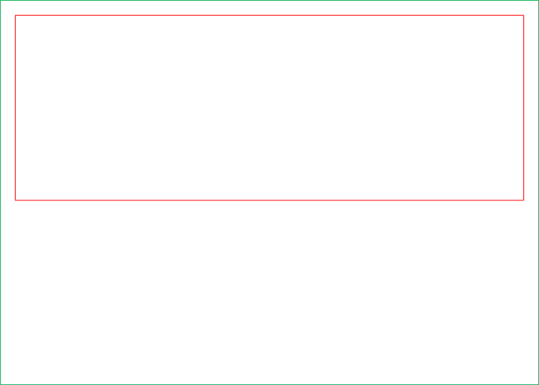

``` r
dev.off() # reset par() to factory default.
```

    ## null device 
    ##           1

``` r
par('mar') # back to default
```

    ## [1] 5.1 4.1 4.1 2.1

``` r
# let's see how these margins match up with an actual plot

plot.new()
box("plot", col="red")
box("figure", col="blue")
box("outer", col="green") 
```

Axes (Ax-ees, not axes) and a little more par()
===============================================

This section is all about customising axes. One of my least favourite things about base R graphics are the default axes. So let's learn how to make them more favouriter. Or something...

Let's start by looking at R's default axes

``` r
# generate some random data to check out
x<-sample(c(0:100),50)
y<-x+x^2

plot(y ~ x) # plot
```

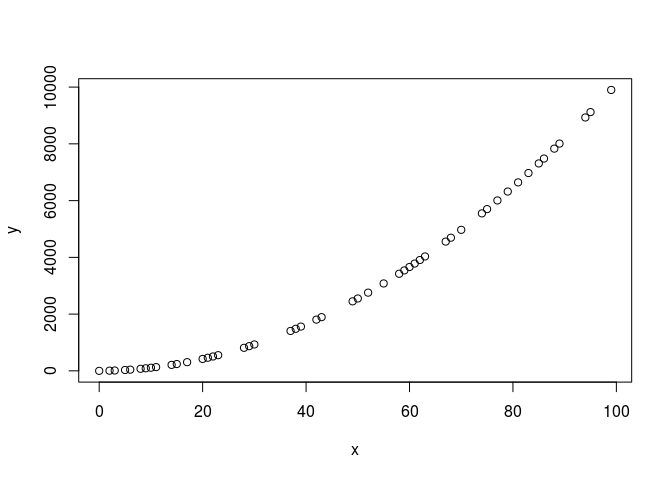

They are a bit sad, for my taste at least. The numbers are too big, the tick marks are too long, and I like my Y-axis numbers to be horizontal.

How do we change all that Tim, I hear you ask? Well, like they say, "there are many way to extract a feline's dermal layers from the rest of corporeal form".

First off, we can adjust some of them by adding arguments to our plot() function

``` r
plot(y ~ x, # these are plot() commands to plot our coordinates             
     las = 1, # this changes the number orientation to be always horizontal
     cex.axis = 0.8, # this changes the size of the axes numbers (0.8 = 80% of original size) 
     tck = -0.02) # This changes the tick marks (negative point outwards, positive point into plot)
```

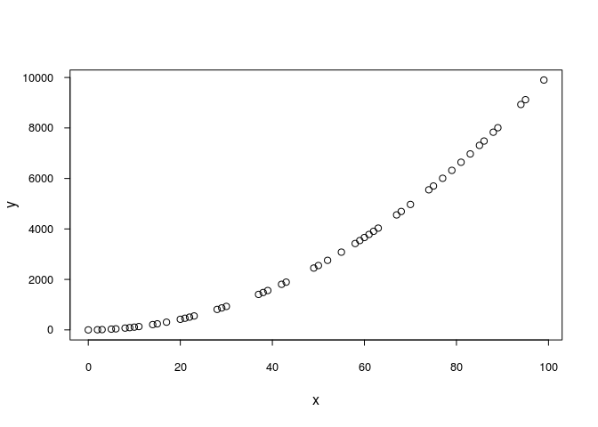

So all of these arguments are actually calls to par() that plot() hands off when it's finished with its actual work. This code fixes some of our problems, but now the numbers are too far away from their respective tick-marks. We can fix this, but like sailing the Straits of Gibraltar in the Bronze Age, it's going to get a little treacherous.

``` r
plot(y ~ x, las=1, cex.axis=0.8, tck=-0.02, # as before
        mgp=c(3,0.45,0))
```


mgp controls the distance of your axis labels ("x" and "y" in this case), the distance of the axes numbers from their tick marks, and where the axis line is actually drawn, respectively (defaults are c(3, 1, 0)).

We still want the axis drawn at the 0 mark, and the labels were fine so all we need to do is change the middle number to push the axes numbers closer to the tickmarks. Bloody bonza! Now because these are all arguments in par() which plot() just hands off, we can set them up as global settings BEFORE we plot which means we don't need to specify them in every plot command...

``` r
par(las=1, cex.axis=0.8, tck=-0.02, mgp=c(3,0.45,0))
plot(y ~ x)
```


Just remember that R will keep these settings.

Ax-ees
------

Now to talk about what I actually said I was going to talk about at the start of this section: plot axes.

Instead of mucking around with par calls, R has a function that allows us to set up our own custom axes from scratch. To use it, we plot as normal, but suppress R's depressing generic axes.

``` r
plot(y ~ x, axes=F)

axis(side = 2, # what axis are we plotting (same as mar, 1=bottom, 2=left, 3=top, 4=right)?
     at = c(0,2500, 5000, 7500, 10000), # where do we want to put tick marks (in the axis units)?
     labels = c(0,2500, 5000, 7500, 10000), # what labels do we want to put beside those tick marks?
     tck = -0.02, # How big should the tick marks be?
     hadj = 0.75, # How far away should the labels be from the tick marks?
     las = 1, cex.axis = 0.8)

# And repeat for the bottom axis, with a few minor adjustments
axis(side = 1, at = c(0,25,50,75,100),
     labels = c(0,25,50,75,100), tck = -0.02,
     padj = -1.55, las = 1, cex.axis = 0.8)
```

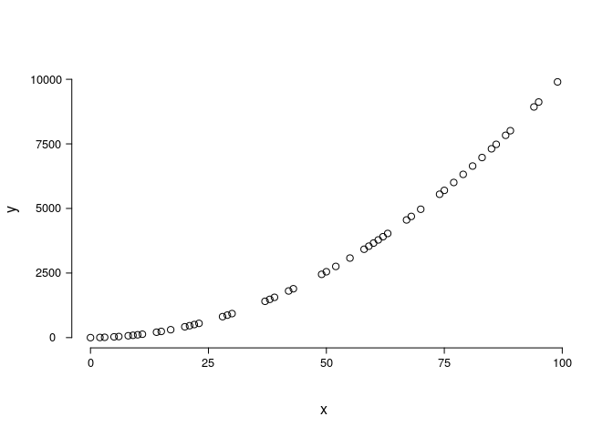

Notice how we used padj to set label distance for the x axis? That's because hadj works for labels perpendicular to the axis line (e.g., horizontal labels on a vertical line = perpendicular). Our x-axis has horizontal labels on a horizontal line (so, parallel), so we need to use padj instead.

The advantage of axis() over par()? R has an algorithm for making 'pretty' default axes (seriously, it's called 'pretty' - see ?pretty), but they may not suit exactly what you want. axis() let's you set your own axis intervals. You can also plot categories instead of numbers easily without freaking R out, just by changing the axis labels.

``` r
plot(sample(1:10, 5, replace=T) ~ rep(1:5, 1), 
     axes = F, ylab = "", xlab = "") # generate some random numbers at positions 1:5 on x-axis

axis(side = 1, # what axis are we plotting (same as mar, 1=bottom, 2=left, 3=top, 4=right)
     at = c(1:5), # where do we want to put tick marks?
     labels = c("Species A", "Species B", "Species C", 
              "Species D", "Species E"), # what labels do we want to put beside those tick marks?
     tck = -0.01, #How big should the tick marks be?
     padj = -1.5, #How far away should the labels be from the tick marks
     las = 1, cex.axis = 0.8)

axis(side = 2, at = c(1:10), labels = c(1:10), tck = -0.01, hadj = 0.3, las = 1)
box() # make a nice box around the axes
```


This can be useful when you want to plot categories but want fine-scale control over where they're plotted

The edges of axes
-----------------

Does it annoy anyone else that the x-axis starts before the zero point? I know it's useful in situations where you have data with a zero value, but if I don't, I like to get rid of it.

We can set the limits of our x-axis, but that doesn't fix the problem at all. So what are the actual limits of our x-axis? We can check this by calling par("usr"), so long as we have an active plot device.

``` r
plot(y ~ x, xlim=c(0,100)) 
```

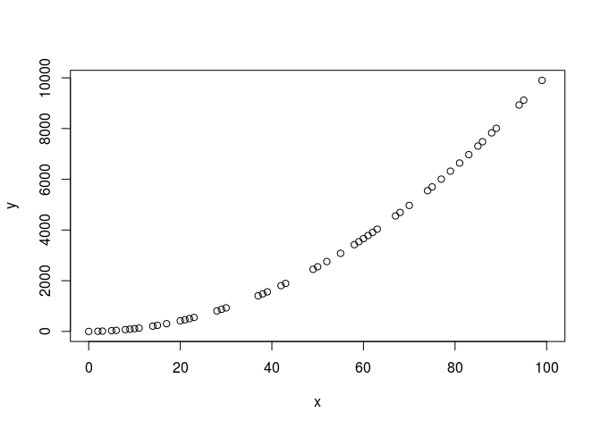

``` r
par("usr")[1:2]
```

    ## [1]  -4 104

-4 to 104? That's not what I specified.

So it turns out that R likes to add 4% on either side of what you specify as the axis limits. "?par()" doesn't tell you why, it just tells you that's called the 'regular' style.

There is an alternative, all we need to do is tell R we want to use 'internal' style axes instead, by setting xaxs and/or yaxs to "i".

``` r
plot(y ~ x, xlim=c(0,100), xaxs="i") # magic
```

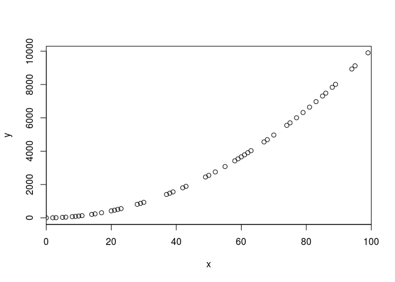

``` r
par("usr")[1:2]
```

    ## [1]   0 100

Much better! You might see this is as a silly aside that doesn't really matter, and you're mostly right - apart from the aesthetic elegance of axis ticks marks that end with the plot window, there's not a lot of function here. But I think it's more elegant, and I'm sticking to that.

Plot limits
===========

How plot() clips your data to the plot window
---------------------------------------------

Have you ever noticed that R keeps all of your points and plot stuff within the plot window (the red box from before), even if the things you plot extend beyond your plot limits? No? Let's correct that.

Let's reduce our x-axis limit

``` r
plot(y ~ x, xlim=c(0,50))
```

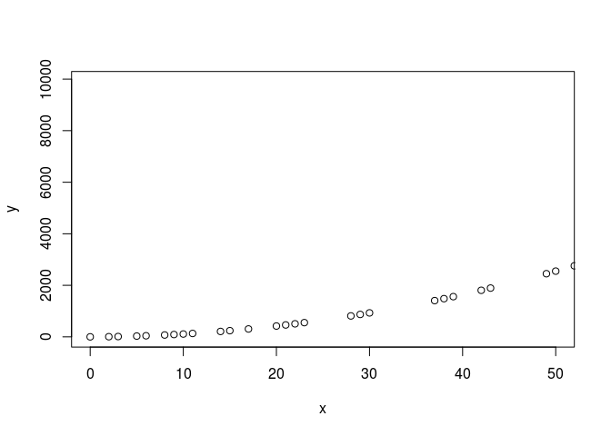

See how all those other points disappeared? Even if I put some white space on the right-hand side of the plot, they don't come back.

``` r
par(mar=c(3,3,1,15))
plot(y ~ x, xlim=c(0,50))
```

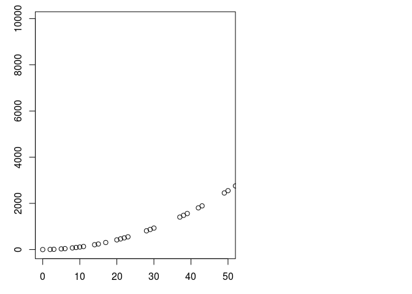

How is the plot space removing them? Well, it's not. I can show you by changing a a graphical parameter called xpd. xpd tells plot() where it's allowed to show points. Normally R plots all points, even those outside the plot area, they're just invisible, behind the white space outside the plot window, hiding like the Wizard of Oz. Shall we lift the curtain?

Do we dare?

Yes.

``` r
par(mar=c(3,3,1,15), xpd=TRUE)
plot(y ~ x, xlim=c(0,50))
```

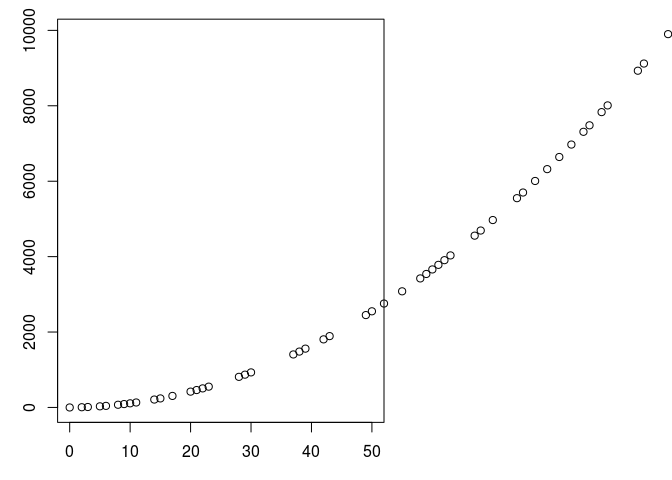

We didn't change anything except where the plot region clips your visibility. So why bring this up at all? Well, there's one issue, and one opportunity.

The issue
---------

Let's scale up to a larger dataset with 10,000 points, make a .pdf file plot, and then read how big it is.

``` r
set.seed(50505)
a<-rnorm(10^5)
b<-rnorm(10^5)

pdf("all points.pdf")
plot(b ~ a)
dev.off()
```

    ## png 
    ##   2

``` r
file.info("all points.pdf")$size
```

    ## [1] 694542

That size is in bytes, so that plot is ~700 KB. If you have a couple of those in a paper, even if the journal doesn't muck them up and de-optimise the files, the filse size for your paper can get very large very fast!

Now say we actually just want to plot a subset of these points, say everything between zero and two (roughly 1/4 of the points). We could just set the axis limits.

``` r
pdf("crop points.pdf")
plot(b ~ a, xlim = c(0, 2), ylim = c(0, 2))
dev.off()
```

    ## png 
    ##   2

``` r
file.info("crop points.pdf")$size
```

    ## [1] 319911

This does a bit to reduce our file size (to about 300KB). We should have seen it reduce to a quarter right, we're only plotting a quarter of the points!

What I forgot is that R is still plotting points outside my plot space, and then just hiding them. But they're still in the file!

If I crop the points entirely, and re-plot, I should end up with a smaller file.

``` r
a.sub<-a[a>=0 & a<=2 & b>=0 & b<=2]
b.sub<-b[a>=0 & a<=2 & b>=0 & b<=2]

pdf("sub points.pdf")
plot(b.sub ~ a.sub)
dev.off()
```

    ## png 
    ##   2

``` r
file.info("sub points.pdf")$size
```

    ## [1] 169723

That's better. If you're working with shape files or picture files, or huge data-sets, remember that your pdf output file might contain things you can't see, but are still taking up lots of space!

The opportunity
---------------

We're going to mess with multiple plots in a single figure in a moment, but sometimes you just want something simple - like a legend to be plotted beside your plot rather than inside it.

``` r
plot(y ~ x, xlim=c(20,100))
points(y/2 ~ x, col="blue", pch=5)
points(y*3 ~ x, col="green", pch=3)
points(y*8 ~ x, col="red", pch=2)

# now we can try to put a legend in here, but there's not a lot of room
legend(x=20, y=10000, 
       legend=c("Species A", "Species B", "Species C", "Species D"),
       pch=c(1, 5,3,2), col=c("black", "blue", "green", "red"), bty="n")
```


As a simple alternative, I can make some white space on the right-hand side by increasing my margins, and then plot my legend outside using the xpd argument we used before.

``` r
par(mar=c(5.1,4.1,4.1,6))
plot(y ~ x, xlim=c(20,100))
points(y/2 ~ x, col="blue", pch=5)
points(y*3 ~ x, col="green", pch=3)
points(y*8 ~ x, col="red", pch=2)

par(xpd=TRUE)
legend(x=103, y=6000,  # now notice my x point is outside of my plot limits...
       legend=c("Species A", "Species B", "Species C", "Species D"),
       pch=c(1, 5,3,2), col=c("black", "blue", "green", "red"), bty="n")
```

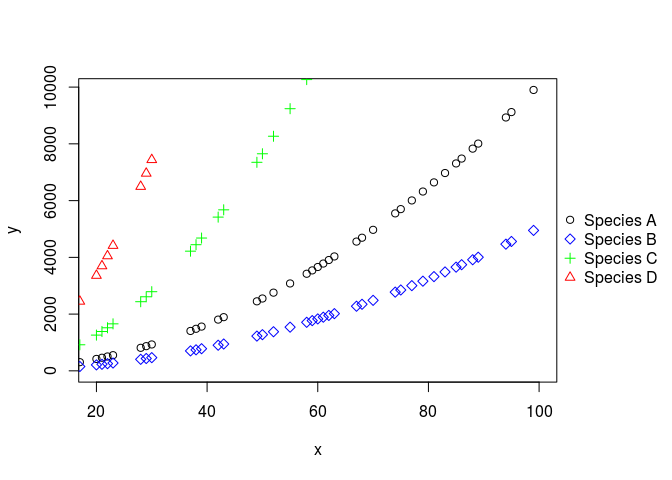

Multi-plotting
==============

Okay, enough with the mucking around - let's get multi-plotting. Let's start by generating some data. It's some simple site-level data with individuals of 3 species observed, with a 'size' measure for each individual.

``` r
set.seed(10101)
species.temp<-sample(1:3,1000, replace=TRUE)
data<-data.frame(site=rep(1:10,100),
                 rainfall=rep(sample(100:1000, 10), 100),
                 species=c("A","B","C")[species.temp],
                 size=c(20,50,5)[species.temp] + sample(1:100, 1000, replace=TRUE))
data<-data[order(data$site),] # order our data by site
```

We can show these data a number of ways. Some examples are:

``` r
# a box and whisker plot of each species' size range
boxplot(data$size ~ data$species)
```

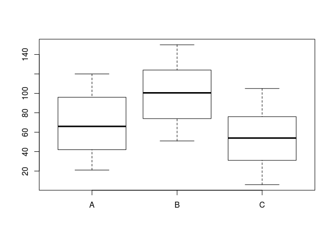

``` r
# a scatterplot of each species' size in different rainfall conditions
# e.g. species A
with(data[data$species=="A",], plot(size ~ rainfall))
```


``` r
# or represent species abundance as a density function
plot(density(table(data$species, data$site)[1,], from=0))
```

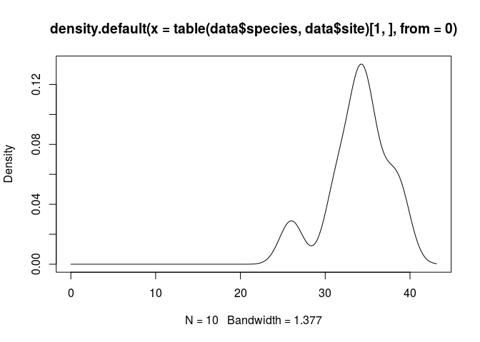

We also have 3 options to plot these things together, in order of increasing power and complexity:

-   setting up par(mfrow) or par(mfcol)
-   creating a layout() matrix
-   setting coordinates with split.screen()

I'm going to use some Greek mythology to help you visualise the power and flexibility of these tools - don't be alarmed, but consider yourself warned.

mfrow & mfcol, The Hercules (Heracles?) of multi-plotting
---------------------------------------------------------

mfrow is a graphical parameter that creates a grid of rows and columns, so the total plot number is nrows x ncols.

When we set our mfrow, we set the row number THEN column number. Alternatively you can set mfcol, but then the numbers are columns THEN rows

``` r
par(mfrow=c(2,3)) # par(mfcol=c(3,2))  (2 rows and 3 columns)

boxplot(data$size ~ data$species)
a<-sapply(c("A","B","C"), function(x){with(data[data$species==x,], plot(size ~ rainfall))})
a<-sapply(c(1:2), function(x){plot(density(table(data$species, data$site)[x,], from=0))})
```

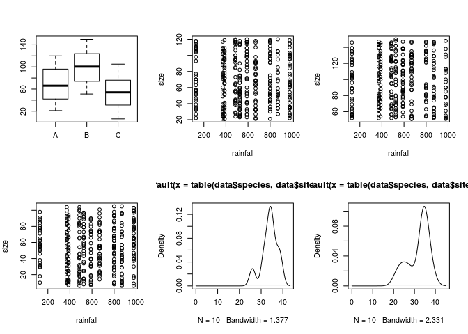

You can see that with default par settings, there's a lot of white space around our plots. Let's take a closer look at why and how we can manipulate it.

``` r
par(mfrow=c(2,3)) # par(mfcol=c(3,2))  (2 rows and 3 columns)

a<-sapply(c(1:6), function(x){plot.new()
                              box("outer", col="green") 
                              box("figure", col="blue") 
                              box("plot", col="red")
                            })
```


In this case, our 'plot' space is really small, just inside the red boxes, and our figure space (outside the blue box) is really large. There is no outer space, as the blue boxes and green boxes overlap. With this knowledge, we can adjust the space between our plots by adjusting our margins.

``` r
par(mfrow=c(2,3), mar=c(2,2,1,1), oma=c(1,1,1,1))

a<-sapply(c(1:6), function(x){plot.new()
                              box("outer", col="green") 
                              box("figure", col="blue") 
                              box("plot", col="red")
                             })
```

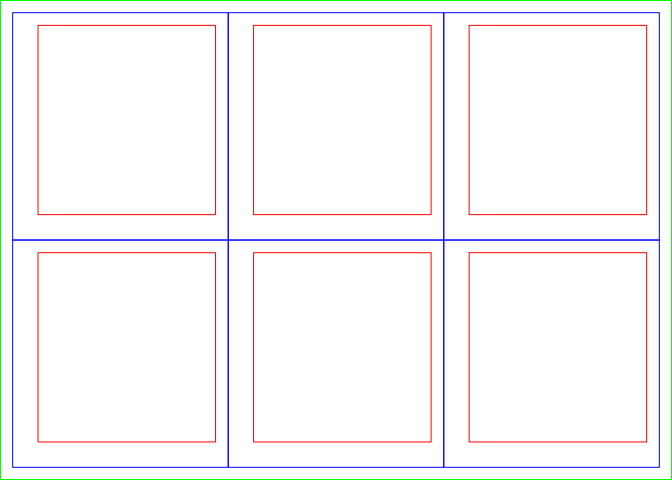

Now we've increased our plots space - I've also added a small outer margin, which you can see as the space between the blue and green boxes. Notice that this space goes around ALL the plots rather than around each individual plot - that's useful and important to remember. How, you ask?

Well, what if you had the same axes for each plot and didn't want to have them on each plot individually? We can set our inner (red to blue) margins to 0, and just set outer margin (blue to green) with space for our axis labels etc.

There's cleverer ways to do this, but I figured I'd run each plot individually so you can see how I suppress the axes.

``` r
par(mfrow=c(2,3), mar=c(0,0,0,0), oma=c(3,3,1,1))

# plot 1 
plot(x=x, y=sample(1:100,50), xaxt="n")

# plot 2
plot(x=x, y=sample(1:100,50), axes=F)
box()

# plot 3
plot(x=x, y=sample(1:100,50), axes=F)
box()

# plot 4
plot(x=x, y=sample(1:100,50))

# plot 5
plot(x=x, y=sample(1:100,50), yaxt="n")

# plot 6
plot(x=x, y=sample(1:100,50), yaxt="n")
```

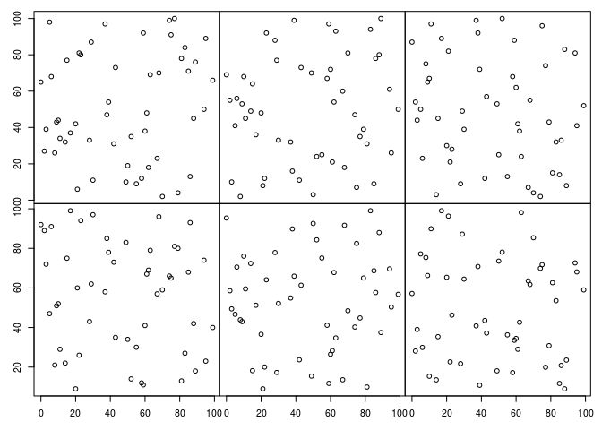

layout(), the Dionysis of multi-plotting
----------------------------------------

Layout lets us allocate our plot space to multiple figures by creating a matrix with plot numbers. This overcomes the major limitation of mfrow and mfcol, which is that the plots are constrained to a matrix format with equal sizes. Here's how layout works, with a simple example:

``` r
layoutmat<-rbind(c(2,2), c(1,3)) # set up a 2x2 matrix with plot-space 
# assigned to plots
layout(layoutmat) # layout() assigns our matrix to the plot-space
layout.show(3) 
```

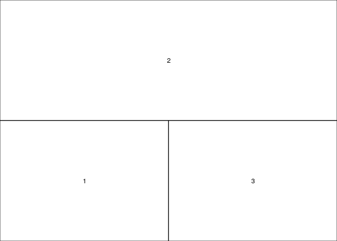

R will assign plots to space based on the numbered order. You can use layout.show() to see up how space is allocated up to a given plot number (we only have 3 plots, so we see all of them here). In this example layout, the bottom-left plot is plotted first, then the top plot, and finally the bottom-right plot. Before we start plotting let's look at how our margins look with layout.

``` r
par(mar=c(2,2,2,2), oma=c(1,1,1,1))

layout(rbind(c(2,2), c(1,3)))

a<-sapply(c(1:3), function(x){plot.new() # empty plot window
  box("outer", col="green") 
  box("figure", col="blue") 
  box("plot", col="red")
})
```

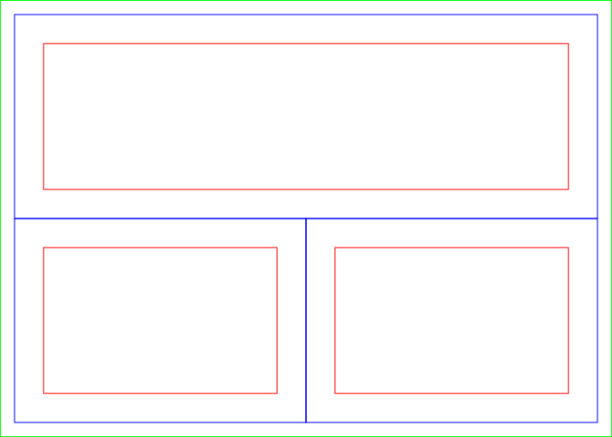

Again, plot and figure space is defined for each sub-plot, and the outer margin area is around ALL the plots, rather than each plot individually. Let's try a more advanced layout for some of our 'data' plots.

``` r
layoutmat<-rbind(c(1,1,2,5),
                 c(1,1,3,6),
                 c(1,1,4,7))

layout(layoutmat)
layout.show(7)
```

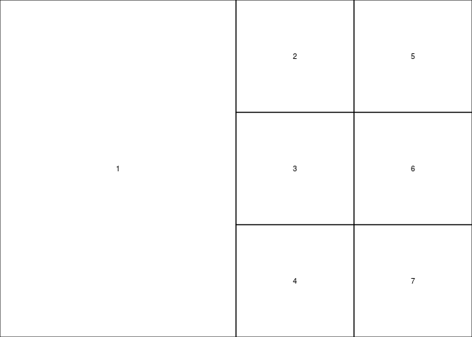

Once we run the layout() command, we can run through our plot code again (with layout sending the plots to each numbered section in sequence).

``` r
layout(rbind(c(1,1,2,5),
             c(1,1,3,6),
             c(1,1,4,7)))

boxplot(data$size ~ data$species)
a<-sapply(c("A","B","C"), function(x){(with(data[data$species==x,], plot(size ~ rainfall)))})
a<-sapply(c(1:3), function(x){plot(density(table(data$species, data$site)[x,], from=0))})
```

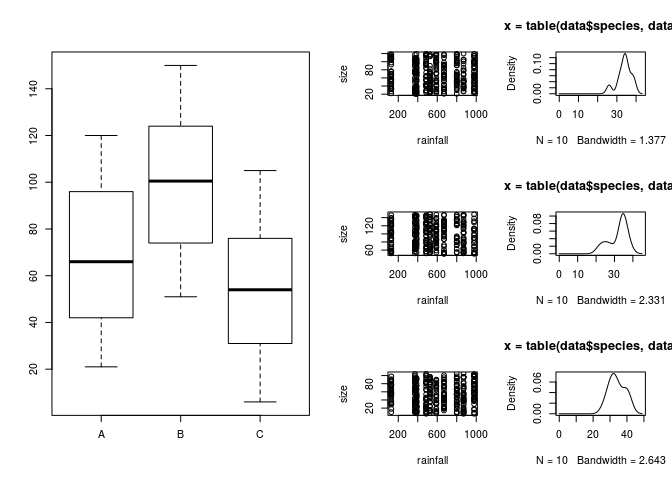

This is looking better, but there's still some issues with white space. It'd be nice to be able to adjust our margins for each plot, especially for our scatter and density plots. Let's try adjusting our margins to give us white space only around the exterior

``` r
par(mar=c(0,0,0,0), oma=c(3,3,1,1))

layout(rbind(c(1,1,2,5),
             c(1,1,3,6),
             c(1,1,4,7)))

boxplot(data$size ~ data$species)

a<-sapply(c("A","B","C"), function(x){(with(data[data$species==x,], plot(size ~ rainfall)))})
a<-sapply(c(1:3), function(x){plot(density(table(data$species, data$site)[x,], from=0), main="")})
```


So that works a little bit, but now we don't have any white space between the interior plots. There's two solutions here. Option 1 is to reset our margins between each plot. Option two is to give layout a larger matrix with some plots we don't intend on filling.

**Option one**

``` r
par(mar=c(0,0,0,0), oma=c(3,3,1,1))

layout(rbind(c(1,1,2,5),
             c(1,1,3,6),
             c(1,1,4,7)))

boxplot(data$size ~ data$species)

par(mar=c(0,3,0,0)) # set inner margins to give us some left-hand white space
a<-sapply(c("A","B","C"), function(x){(with(data[data$species==x,], plot(size ~ rainfall)))})
a<-sapply(c(1:3), function(x){plot(density(table(data$species, data$site)[x,], from=0), main="")})
```

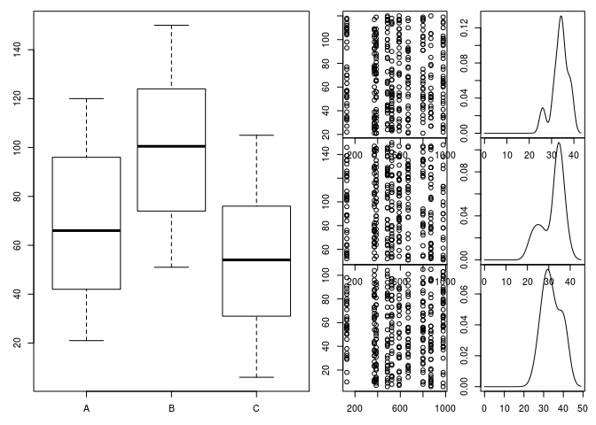

**Option two**

Look at the new layout

``` r
layout(rbind(c(1,1,1,1,8,2,9,5),
             c(1,1,1,1,8,3,9,6),
             c(1,1,1,1,8,4,9,7)))

layout.show(9)
```


We're only going to plot up to 7, which means our final plot will look like this:

``` r
layout(rbind(c(1,1,1,1,8,2,9,5),
             c(1,1,1,1,8,3,9,6),
             c(1,1,1,1,8,4,9,7)))

layout.show(7)
```

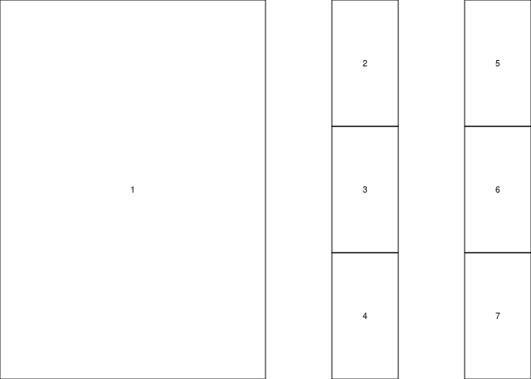

And now with our data plots

``` r
layout(rbind(c(1,1,1,1,8,2,9,5),
             c(1,1,1,1,8,3,9,6),
             c(1,1,1,1,8,4,9,7)))

par(mar=c(0,0,0,0), oma=c(3,3,1,1))
boxplot(data$size ~ data$species)
a<-sapply(c("A","B","C"), function(x){(with(data[data$species==x,], plot(size ~ rainfall)))})
a<-sapply(c(1:3), function(x){plot(density(table(data$species, data$site)[x,], from=0), main="")})
```

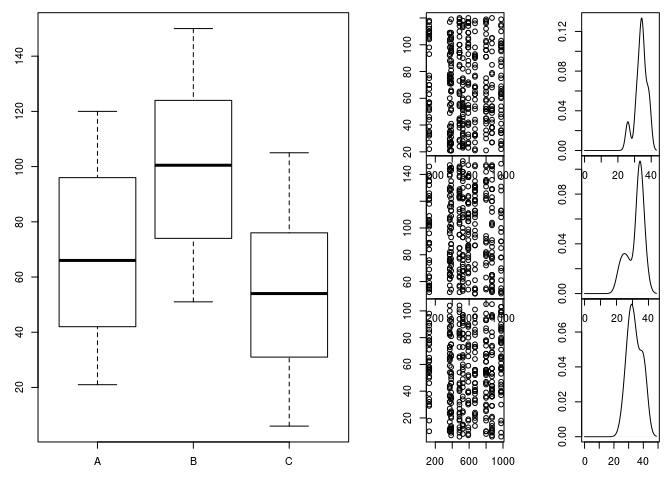

It's up to you which solution you prefer. Both can be useful, although, if you're getting to this level of complexity, you may as well suck it up and start working with the most powerful multi-plotting tool that comes with base R: split.screen.

Split.screen, the Zeus of multi-plotting.
-----------------------------------------

Bias up front and center: I love split.screen. For publication-quality figures, I never use layout, and rarely use mfrow.

Split.screen differs from mfrow() and layout() in that it lets us set actual coordinates for each of our sub-plots, by imagining our total figure space like this:

``` r
par(mar=c(0,0,0,0),oma=c(0,0,0,0))
plot(x=NULL,y=NULL, xlab="", ylab="", xlim=c(0,1), ylim=c(0,1), tck=0.01, 
     mgp=c(0,-2,0), las=1)
```


To use split.screen, we create a matrix like in layout, but instead of dividing the plot space up, the matrix has as many rows as we want plots, and always has four columns. In each column, we assign left, right, bottom and top coordinates for each plot. **These are in a different order to when we change margins**.

-   mar, oma order is: BOTTOM, LEFT, TOP, RIGHT (clockwise)
-   split.screen order is: LEFT, RIGHT, BOTTOM, TOP (x-boundaries, then y-boundaries)

Split.screen has one more thing that makes it trickier to use than the others functions, as we actually have to 'call' each plot up as we plot it, then close it when we're done. It might sound confusing, but it actually works well logically, and let's anyone looking at your code see quickly where each plot starts and finishes.

Let's give it a go. I'll code each plot ('screen') separately so you can see the syntax.

``` r
par(mar=c(1,1,1,1),oma=c(3,3,3,3))

split.screen(rbind(c(0, 0.7, 0.3, 1),   # set up screen coordinates
                  c(0, 0.35, 0, 0.3),     
                  c(0.35, 0.7, 0, 0.3),   
                  c(0.7, 1, 0.5, 1),      
                  c(0.7, 1, 0, 0.5)))
```

    ## [1] 1 2 3 4 5

``` r
screen(1) # start screen 1 code
plot.new()
box("plot", col="red")
box("figure", col="blue") 
box("outer", col="green")
text(x=0.5, y=0.5, labels=1)
close.screen(1) # close screen
```

    ## [1] 2 3 4 5

``` r
screen(2)
plot.new()
box("plot", col="red")
box("figure", col="blue") 
box("outer", col="green")
text(x=0.5, y=0.5, labels=2)
close.screen(2)
```

    ## [1] 3 4 5

``` r
screen(3)
plot.new()
box("plot", col="red")
box("figure", col="blue") 
box("outer", col="green")
text(x=0.5, y=0.5, labels=3)
close.screen(3)
```

    ## [1] 4 5

``` r
screen(4)
plot.new()
box("plot", col="red")
box("figure", col="blue") 
box("outer", col="green")
text(x=0.5, y=0.5, labels=4)
close.screen(4)
```

    ## [1] 5

``` r
screen(5)
plot.new()
box("plot", col="red")
box("figure", col="blue") 
box("outer", col="green")
text(x=0.5, y=0.5, labels=5)
```

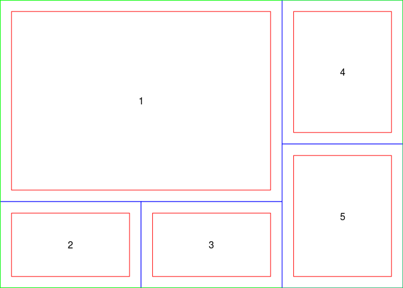

``` r
close.screen(5)

close.screen(all.screens=TRUE) 
```

    ## [1] FALSE

One thing you can notice that differs from mfrow() and layout() is that there are NO outer margins. You can change the oma argument above to anything you like and it won't plot any space between the blue and green lines!

Another thing: split.screen remembers left-over screens. That's bad news, so in case you ever miss a screen, it's best to have use the line at the end of the last plotting code to mop up any leftover screens we forgot about.

Now let's try plotting our example plots using splitscreen

``` r
par(mar=c(2,2,2,2))
split.screen(rbind(c(0, 0.5, 0, 1),      
                  c(0.5, 0.75, 0, 0.33),     
                  c(0.5, 0.75, 0.33, 0.67),
                  c(0.5, 0.75, 0.67, 1),
                  c(0.75, 1, 0, 0.33),     
                  c(0.75, 1, 0.33, 0.67),
                  c(0.75, 1, 0.67, 1)))
```

    ## [1] 1 2 3 4 5 6 7

``` r
screen(1)
boxplot(data$size ~ data$species)
close.screen(1)
```

    ## [1] 2 3 4 5 6 7

``` r
a<-mapply(x=c("A","B","C"), y=2:4, function(x,y){
  screen(y)
  with(data[data$species==x,], plot(size ~ rainfall))
  close.screen(y)})

a<-mapply(x=c(1:3), y=5:7, function(x,y){
  screen(y)
  plot(density(table(data$species, data$site)[x,], from=0))
  close.screen(y)})
```

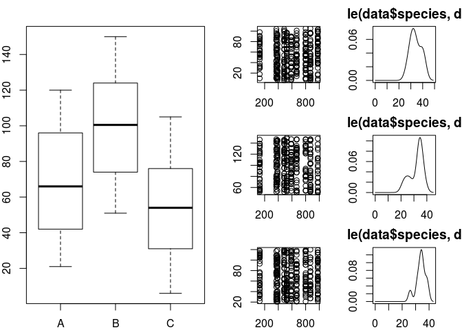

So we're having issues with too much white space again, and we could solve this by calling par() after opening a screen() and setting specific margins - but we don't have to! Instead, we can just adjust our sub-plot coordinates to allow for some white space.

``` r
par(mar=c(0,0,0,0))    

split.screen(rbind(c(0.1, 0.4, 0.1, 0.99),      
                  c(0.5, 0.7, 0.1, 0.4),     
                  c(0.5, 0.7, 0.4, 0.7),
                  c(0.5, 0.7, 0.7, 0.99),
                  c(0.8, 0.99, 0.1, 0.4),     
                  c(0.8, 0.99, 0.4, 0.7),
                  c(0.8, 0.99, 0.7, 0.99)))
```

    ## [1] 1 2 3 4 5 6 7

``` r
screen(1)
boxplot(data$size ~ data$species)
close.screen(1)
```

    ## [1] 2 3 4 5 6 7

``` r
a<-mapply(x=c("A","B","C"), y=2:4, function(x,y){
  screen(y)
  with(data[data$species==x,], plot(size ~ rainfall))
  close.screen(y)})

a<-mapply(x=c(1:3), y=5:7, function(x,y){
  screen(y)
  plot(density(table(data$species, data$site)[x,], from=0))
  close.screen(y)})
```


Now I know the figure still looks ugly, so let's do some clean-up work and get things looking a little nicer. I've mostly just adjusted the axes as per the previous section, and added a splash of color.

``` r
par(mar=c(0,0,0,0), oma=c(0,0,0,0), las=1, ps=8, mgp=c(3,0.25,0), tck=-0.01)                  
split.screen(rbind(c(0.075, 0.4, 0.1, 0.95),      
                  c(0.5, 0.7, 0.1, 0.375),     
                  c(0.5, 0.7, 0.375, 0.675),
                  c(0.5, 0.7, 0.675, 0.95),
                  c(0.8, 0.99, 0.1, 0.375),     
                  c(0.8, 0.99, 0.375, 0.675),
                  c(0.8, 0.99, 0.675, 0.95)))
```

    ## [1] 1 2 3 4 5 6 7

``` r
screen(1)
boxplot(data$size ~ data$species, col=c(rgb(1,0.7,0.7,1),
                                        rgb(0.7,1,0.7,1), 
                                        rgb(0.7,0.7,1,1)))
mtext(side=2, las=3, text="Size (cm)", line=1.5, cex=1.25)
close.screen(1)
```

    ## [1] 2 3 4 5 6 7

``` r
a<-mapply(x=c("A","B","C"), y=2:4, function(x,y){
  screen(y)
     with(data[data$species==x,], 
       plot(size ~ rainfall, pch=16, axes=FALSE,
            xlim=c(min(data$rainfall)-10, max(data$rainfall)+10),
            ylim=c(min(data$size), max(data$size)+10),
            col=c(rgb(1,0.7,0.7,1),rgb(0.7,1,0.7,1),rgb(0.7,0.7,1,1))[y-1]))
     
  if(y==2){axis(side=1);axis(side=2)}
  
  if(y!=2){axis(side=1, labels=NA);axis(side=2)}
  box()
  
  close.screen(y)})

a<-mapply(x=c(1:3), y=5:7, function(x,y){
  screen(y)

      plot(density(table(data$species, data$site)[x,], from=0), main="", axes=F,
         ylim=c(0,0.22), xlim=c(0,50), type="n")
      polygon(density(table(data$species, data$site)[x,], from=0), 
              col=c(rgb(1,0.7,0.7,1),rgb(0.7,1,0.7,1),rgb(0.7,0.7,1,1))[y-4])

    if(y==5){axis(side=1);axis(side=2)}
    
    if(y!=5){axis(side=1, labels=NA);axis(side=2)}
    box()   
   close.screen(y)})
```


This is the tip of the iceberg of what you can accomplish using these tools. I've tried to give you a simple overview of how these functions work, but to continue to use metaphors, the sky is the limit, the world is your oyster, and there are no cooks and an abundance of broth. Go forth and plot, my friends.

**Credits**

-   Tim Staples, as Tim Staples
-   R Statistical Environment as R
-   split.screen as Zeus
-   Garry the blacksmith, for supplying all the axes - dammit Garry, I said ax-ees!
